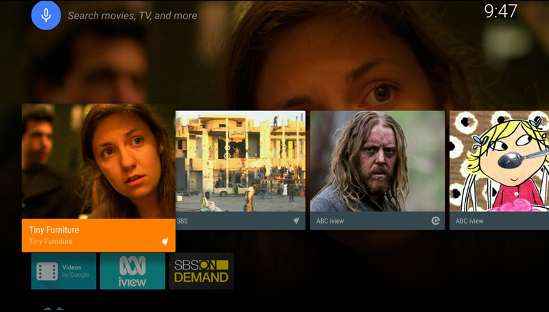
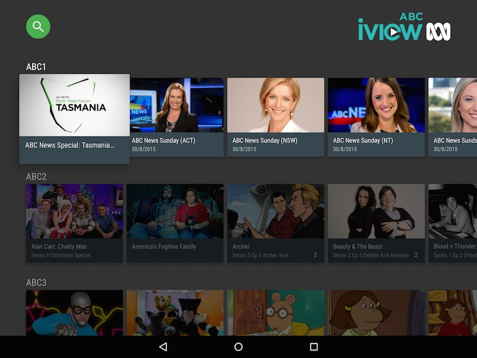
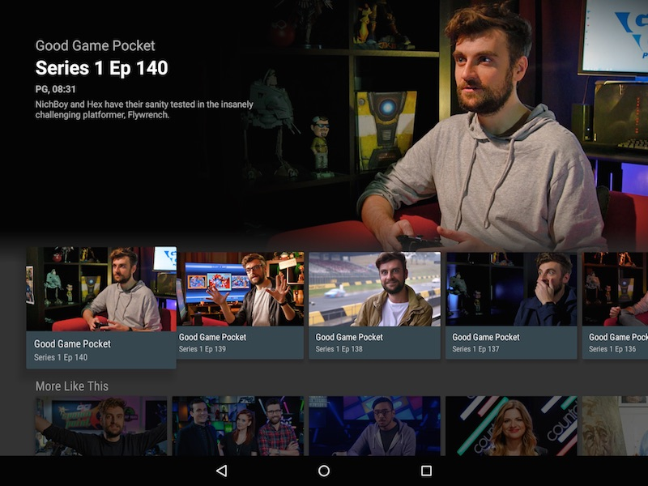

# Android TV apps for ABC iview and SBS
2 basic TV apps that will stream content from ABC iview and SBS. 

ABC iview for Android TV
-------------------------

SBS for Android TV
------------------

To build
--------
Create a file named `app.properties` in the project that
defines the API urls for the ABC iview and SBS services.
See gradle build error messages for details.
